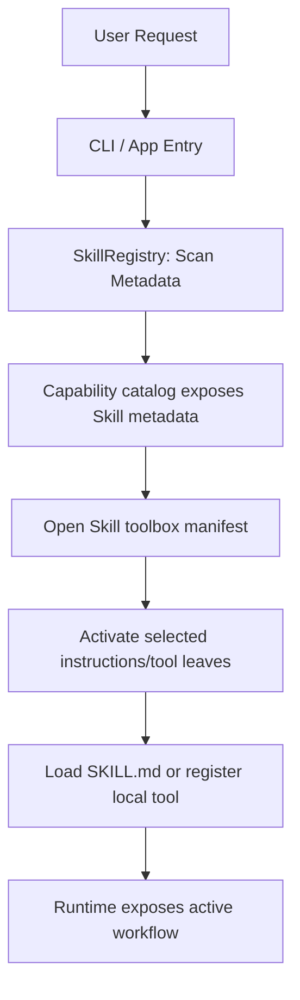

# 扩展：Skill 系统

## 文档职责

This document focuses on the Skill system only:

- skill directory structure and metadata
- discovery and matching
- runtime loading and prompt injection
- future references, assets, and scripts lifecycle

It does not redefine the whole runtime architecture or generic extension model:

- overall runtime layering: `docs/architecture.md`
- generic extension hooks: `docs/extensions/runtime-interfaces.md`
- capability warehouse, toolbox manifests, progressive disclosure, and activation: `docs/extensions/capability-warehouse.md`
- roadmap priority and rollout stages: `docs/roadmap.md`

Skill 在能力可见性上属于工具箱：默认只暴露 metadata 和简短描述，打开后展示 instructions/references/assets/scripts 索引，激活时才加载当前步骤需要的内容。该目标模型以 `docs/extensions/capability-warehouse.md` 为准；本文档继续负责 Skill 文件结构和箱内资产语义。

This document defines the Skill file format, discovery sources, toolbox contents, activation semantics, and current runtime boundary. Global priority and completion tracking remain in [the roadmap](../roadmap.md).

---

## 1. 目标

Provide standard built-in and custom project/user Skills without loading every instruction body into every
model request. The current application exposes Skill metadata through the capability warehouse;
instructions and explicitly assigned local tools enter the workbench only after capability activation.

Skill loading follows the same long-task context rule as the rest of the runtime: full skill files and referenced artifacts may exist on disk, but the prompt receives only active, task-relevant, budgeted guidance after context packaging. A skill is not a mechanism for bypassing context budgets.

---

## 2. Skill 目录与元数据

Each skill is represented by a directory containing:
1. `SKILL.md`: The markdown instructions that define the behavior, prompts, and context for the skill.
2. Metadata: Defined via **YAML frontmatter** inside `SKILL.md` (YAML blocks between `---`). This keeps dependencies minimal and can be parsed with simple regular expressions.

### YAML Frontmatter Example (`SKILL.md`)
```markdown
---
name: python-unittest-helper
description: Provides guidelines and commands for writing and running Python unit tests.
triggers:
  - "run tests"
  - "python test"
  - "unittest"
version: 1.0.0
---

# Python Unittest Helper Skill

When writing or running Python unit tests:
- Prefer using `pytest` over standard `unittest` unless specified.
- Run tests using the `run_tests` tool.
- If a test fails, read the failing test file, inspect the imports, and check if mock objects are necessary.
```

---

## 3. 目录位置与覆盖顺序

Skills are discovered from three locations:

1. **Built-in Skills**: Shipped under `src/testcode/skills/builtins/`; the
   application resolves this directory relative to the installed package.
2. **User Global Skills**: Stored in `~/.testcode/skills/`.
3. **Project-scoped Skills**: Stored inside the workspace at
   `.testcode/skills/`.

The registry scans in that order and stores Skills by name, so a later
project-scoped Skill replaces a same-named global or built-in Skill; a global
Skill replaces a same-named built-in Skill. The current CLI does not yet emit a
dedicated override diagnostic.

---

## 4. 架构与选择流程

Application composition scans lightweight metadata into `SkillRegistry`, adapts it into
`LocalToolboxSpec`, then exposes it through the shared `LocalToolboxSource`. The model can inspect the
capability catalog, open one toolbox to see its
instructions and local-tool manifest, and activate only the required leaves. Activated Skill content is
attached to `SessionContext`; activated tools are registered through the same atomic warehouse path. A
separate budgeted `ContextPackager` remains planned.



### Core Abstractions

We define the core models in `src/testcode/skills/model.py`:

```python
from dataclasses import dataclass

@dataclass(slots=True)
class SkillMetadata:
    name: str
    description: str
    triggers: list[str]
    version: str
    path: str  # Path to the SKILL.md file

@dataclass(slots=True)
class Skill:
    metadata: SkillMetadata
    content: str  # Markdown instructions under the frontmatter; packaging applies prompt budget.
```

The registry is implemented in `src/testcode/skills/registry.py`:

```python
class SkillRegistry:
    def __init__(self, builtins_dir: str, global_dir: str, project_dir: str) -> None:
        self.dirs = [builtins_dir, global_dir, project_dir]
        self._skills: dict[str, SkillMetadata] = {}

    def scan_metadata(self) -> None:
        """Lightweight scan of skill metadata. Does not load full file contents."""
        pass

    def get_skill(self, name: str) -> Skill | None:
        """Load one explicitly selected Skill after warehouse activation."""
        pass
```

---

## 5. 运行时集成

The active application path is:

### 1. Application Assembly (`src/testcode/app.py`)
- Initialize the `SkillRegistry` with paths resolved dynamically.
- Adapt the registry and its explicitly assigned local tools into `LocalToolboxSpec`, then attach the
  shared `LocalToolboxSource` to `CapabilityWarehouse`.
- Use the shared `LocalToolboxSource` as the only activation path. Trigger strings remain catalog tags for
  discovery; they do not silently inject instructions.

### 2. Execution Engine (`src/testcode/orchestration/engine.py`)
- Restore only persisted `active_capability_ids` at the start of a session run.
- Apply activated generic `InstructionContent` objects from `CapabilityWarehouse` to `SessionContext`.
- Persist session-scoped capability ids into the execution summary; instruction names are not a parallel
  persistence channel.

### 3. Prompt Assembly
- `ModelPromptBuilder.build_messages(session)` reads generic `session.active_instructions` and renders
  active workflow guidance into the system lines:
    ```markdown
    ### Active Workflow Instructions:
    
    [Workflow: python-unittest-helper]
    When writing or running Python unit tests:
    - Prefer using `pytest` over standard `unittest` unless specified...
    ```
- `ContextPackager` now owns the shared prompt budget, prioritized segments and clipping for active Skill content.
  Skill-specific semantic summaries and on-demand source references remain future work behind that boundary.

### 4. Skill References and Artifacts
- `references/`, `assets/`, and `scripts/` must be indexed separately from prompt content.
- Reference files should be read on demand and clipped or summarized before prompt injection.
- Script execution must become an ordinary tool action and pass the same policy, approval, and logging path as built-in tools.
- Workflow content included in a long-task resume packet should be the instruction id, name, version,
  short guidance summary, and source path, not the full body by default.

---

## 6. 日志与可观测性契约

Skill activation must remain observable through the following records:

1. **Capability activation events**:
   - Skill selection uses the same `capability.toolbox.opened`, `capability.activated`,
     `capability.used` and `capability.released` events as other warehouse capabilities.
2. **Run start payload**:
   - `run.start` lists scanned/registered skills for discovery diagnostics:
     ```json
     {
       "registered_skills": ["python-unittest-helper", "git-helper"]
     }
     ```
3. **Trace file (`details.log`)**:
   - The overview lists active workflow instructions:
     ```text
     Overview
     - run_id: 2026-06-23T14-53-32
     - prompt: run tests in this workspace
     - active workflow instructions: python-unittest-helper (v1.0.0)
     ```

---

## 7. 当前边界

The current runtime scans Skill metadata, adapts Skills into the same `LocalToolboxSource` used by other
local capability groups, and activates
instructions and local tools through the capability warehouse, injects active instructions into model
context, and restores session-scoped activations.

There is one Skill activation path: warehouse catalog → toolbox manifest → explicit activation. Built-in
`git-helper` groups Git workflow instructions with the lower-frequency `git_show`; `git_status` and
`git_diff` remain reusable core observation tools. Built-in `pytest-helper` groups `run_tests` with its
workflow instructions. Tool providers own implementations; Skills declare workflow groupings and do not
control whether a core tool exists. The
runtime no longer maintains an independent trigger-matching loader. Standardized on-demand handling for
`references/`, `assets/`, and `scripts`, plus budgeted source references and script approval semantics,
is not yet complete.

Implementation priority and completion status belong to [the roadmap](../roadmap.md); this document owns the Skill format and runtime contract.
