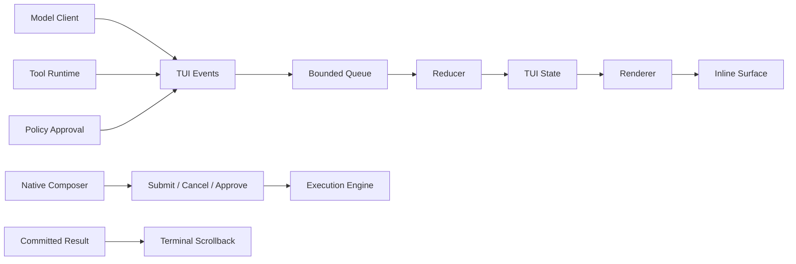

# 完整 TUI 架构与演进方案

## 状态

- 原生 inline backend：已落地
- 集中事件队列、状态与 reducer：已落地
- 模型、工具、审批、取消与运行时输入：已落地
- 模型增量 streaming：待实施
- 统一 overlay 栈：待实施
- 持久化输入历史与长任务 transcript 索引：待实施

当前实现细节见 [TUI 设计与实现](tui_design_and_architecture.md)。

## 1. 架构决策

交互式 CLI 使用正常终端屏幕，不以 fullscreen/alternate screen 保存整份对话。终端原生 scrollback 是稳定历史的显示来源；应用只管理底部瞬态区域。

这项决策同时满足：

- 原生滚轮、选择和复制；
- 已完成内容只提交一次；
- 运行中保留可编辑输入器；
- resize 只重绘瞬态区域；
- 非 TTY 继续使用纯文本；
- 执行引擎不依赖终端框架。

`prompt_toolkit` fullscreen 原型已被移除。原因不是拒绝第三方库，而是 fullscreen transcript 的所有权模型与原生 scrollback、无修饰键文本选择之间存在结构冲突。当前 backend 使用 Python 标准库的 termios、select、ANSI 控制序列和集中状态模型。

## 2. 输出模型

输出分为两条严格路径：

| 类型 | 所有者 | 生命周期 | 示例 |
| --- | --- | --- | --- |
| Stable output | 终端 scrollback | 会话历史 | 启动信息、用户消息、工具结果、回答、耗时分隔线 |
| Transient tail | 应用 surface | 当前输入或 run | spinner、活动工具、审批、composer、模型与 cwd |

任何内容一旦提交为 stable output，就不得由 renderer 再次输出。Transient tail 在停止时必须先完整清除，再提交对应稳定结果。

## 3. 数据流



事件队列允许合并 resize、tick 和 retry 等刷新事件，但不丢弃 run/tool/approval 的生命周期结果。队列满且没有可合并事件时使用背压。

## 4. 输入与线程模型

主线程执行 CLI 和 engine。运行期间：

- 一个输入线程独占 stdin；
- 一个渲染线程以固定刷新间隔消费状态并更新尾部；
- engine 线程只发布进度事件；
- 审批通过共享事件等待结果，不启动第二个 stdin reader；
- 中断通过既有 engine 取消路径返回主循环。

空闲时输入由主线程读取。空闲与运行输入不会同时存在，终端 raw/cbreak 状态由上下文管理并保证恢复。

## 5. 终端 backend 合约

### 必须保证

- 不进入 alternate screen；
- 不启用鼠标报告；
- 不覆盖已经提交的历史；
- 所有瞬态行小于终端宽度，避免隐式 autowrap；
- resize 后从安全顶部清除旧帧，包括旧帧在新宽度下的 reflow 高度；
- 光标最终回到 composer 的视觉位置；
- 异常退出恢复光标和 termios；
- 非 TTY 不输出交互控制序列。

### 允许终端负责

- 历史保存与滚动；
- 原生鼠标选择和复制；
- 已提交长文本与边框的 reflow；
- scrollback 容量与终端自身搜索。

## 6. 状态模型

`TUIState` 只保存当前运行视图，不是会话事实来源：

- session：模型、cwd、终端尺寸；
- run：idle、working、cancelling、开始时间；
- model：thinking/retry 状态；
- tools：稳定 id、状态、摘要；
- approval：请求、选项和当前选择。

Composer 文本、光标、输入历史和下一轮排队消息属于交互状态。持久化 conversation、tool history 和 checkpoint 仍由 session/runtime 层负责。

## 7. 中断与运行中输入

中断状态为：

```text
working → cancelling → idle
```

- Esc/Ctrl-C：取消当前 run。
- 运行时 Enter 提交非空 composer：取消当前 run，并把文本作为下一轮 prompt 排队。
- 未提交草稿：当前 run 结束后恢复到空闲 composer。
- cancelling 状态不重复发送取消信号。

## 8. 后续阶段

### Phase 3：Streaming

- 模型客户端提供增量 delta。
- 活动回答先在 transient tail 中合并。
- 完成后一次性提交 stable output。
- plain 模式定义对应的逐块输出语义。

### Phase 4：Overlay

- 帮助、session、Skill、MCP 和审批共享焦点栈。
- overlay 可按需临时使用 alternate screen，但退出后恢复 normal screen 和 scrollback。
- 覆盖层不得改变 engine/policy 语义。

### Phase 5：可靠性与兼容

- 持久化输入历史。
- 长任务 transcript 建立可搜索索引，不复制终端视觉缓冲。
- 增加 SSH、tmux、Windows Terminal、窄屏和组合字符快照。
- 对不支持 ANSI/cbreak 的终端自动回退 plain presenter。

## 9. 验收标准

- 滚轮不会切换输入历史。
- 鼠标可以直接选择复制，不需要模式切换。
- 运行帧缩放后不在 scrollback 留下重复副本。
- 启动信息和稳定结果只出现一次。
- 输入框、模型状态和审批在运行中可操作。
- Ctrl-C、EOF、异常和正常退出均恢复终端。
- 完整测试通过，并至少用真实 pseudo-terminal 验证一次 shrink/grow。
