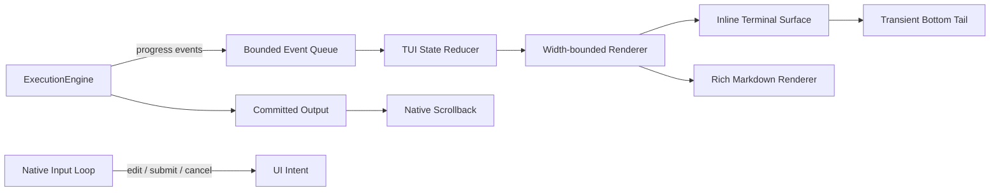

# 交互：TUI 当前行为

## 文档范围

本文档描述当前交互式 TTY 的实际行为。`--once`、重定向、CI 和非 TTY 环境继续使用 `ConsolePresenter` 的逐行输出；交互式会话使用 `TUIConsolePresenter` 的原生终端 backend。

当前实现不依赖 `prompt_toolkit`，也不进入 alternate screen。目标是同时保留终端原生 scrollback、鼠标滚轮、文本选择与复制，并只让程序拥有底部的瞬态活动区域。

## 1. 屏幕所有权

终端内容分为两类：

```text
终端原生 scrollback
├── 启动 Logo 和环境信息
├── 已提交的用户消息
├── 已完成的工具结果
├── 助手回答
└── Worked for … 分隔线

程序控制的瞬态尾部
├── 工具/审批/Thinking 状态
├── 可编辑输入框
└── 模型名称与工作目录
```

稳定内容只写入 stdout 一次，之后由终端保存、重排、滚动、选择和复制。程序不保存第二份可见 transcript，也不捕获鼠标。

瞬态尾部紧跟稳定内容，不强制占用终端物理底边。每次刷新只清理上一次尾部覆盖的区域，再绘制新帧；窗口缩放时会按新宽度计算旧帧可能产生的视觉行数和光标位置，避免留下重复的 Working、输入框、模型状态或空白占位。

## 2. 当前布局

### 启动区

```text
  _            _                 _
 | |_ ___  ___| |_ ___  ___   __| | ___
 ...
────────────────────────────────────────────────────────
 › Workspace:   /workspace
 › Session:     Started - ...
 › Safety Mode: confirm (Tool calls require approval)
 › System:      Python ... on Linux
────────────────────────────────────────────────────────
 › Runtime:
   • 3 Context Loaders
   • 14 Tools
 › Capability Catalog:
   • 4 Toolboxes (2 Skill · 1 Local · 1 MCP)
────────────────────────────────────────────────────────
  Type "exit" or "quit" to end the session.
```

这些内容立即进入原生历史，不会在 resize 时由应用重新打印。
其中 Capability Catalog 的工具箱数量来自统一能力仓库，包括尚未激活的 Skill、Subagent 和 MCP 工具箱；
Runtime 仍只统计当前已加载的组件。
底部状态栏和 `/status` 显示配置的真实模型名称，不将不同 GPT 或 Gemini 模型改写成固定别名。

`/capabilities` 按命令结果显示组织过的目录、工具箱内容、状态或操作回执，不直接输出内部 JSON。
目录例如：

```text
Capability Warehouse
4 toolboxes

• git-helper  Skill · stored
  skill:git-helper
  Safe Git inspection and change workflows.

• subagents  Local · stored
  local:subagents
  Delegate independent work to isolated child sessions.

Open a toolbox with /capabilities open <toolbox-id>
```

### 空闲输入

```text

 testcode> editable input

 ? for shortcuts                                      model
```

输入区有上下留白和灰色背景。内容按 Unicode 显示宽度折行，最多显示 6 行；模型状态位于输入框下方。系统最终输出通过 `rich.markdown` 进行漂亮的终端 Markdown 格式化渲染。

### 斜杠命令自动补全 (Slash Command Autocomplete)

当用户在输入框中输入 `/` 触发命令搜索前缀时，交互界面会在灰色输入框下方显示可选的命令列表与功能说明。为保证界面紧凑，自动补全面板最多同时显示 5 条候选命令，超出时支持窗口上下自动滚动：

```text

 testcode> /
   Commands (14 total): (1-5 of 14)
   › /clear    Clear terminal screen
     /compact  Compact and summarize conversation context
     /exit     Exit workbench session
     /help     Show help message and shortcuts
     /mode     Show or change safety mode
   ▼ (9 more below)

 ? for shortcuts                                      model
```

- **支持的常用指令**：
  - `/help`（或 `?`）：查看帮助与指令列表
  - `/clear`：清空终端屏幕历史（保持上下文记忆）
  - `/reset` / `/new`：重置对话历史，开启新对话
  - `/compact`：压缩并总结历史对话上下文
  - `/status`：查看 Session ID、工作区路径、安全模式、模型与当前能力状态
  - `/resume`：恢复或选择历史会话
  - `/mode`、`/skills`、`/tasks`：查看或切换安全模式、能力仓库中的 Skill 工具箱和后台任务
  - `/capabilities`：列举、打开、激活、释放和查看统一能力仓库
  - `/skill [name]`：通过能力仓库列出或以 session scope 激活一个 Skill
  - `/exit` / `/quit`：退出工作台
- **窗口滚动与导航**：使用 `↑` / `↓` 移动选中项。选中项超出当前可视区域时，
  窗口自动滚动，并显示 `▲ (N more above)` / `▼ (N more below)`。
- **自动填充与提交**：按 `Tab` 填充当前命令并加空格；再次按 `Enter` 提交。
- **取消/关闭**：按 `Esc` 或删除 `/` 关闭补全面板。

#### 二级参数候选

带可选参数的命令统一使用方括号 usage。在一级菜单选中这类命令后按 `Enter`，
或在命令后输入空格/按 `Tab`，都会进入二级候选：

```text
 testcode> /mode
   Options (3 total):
   › readonly  Reject write operations
     confirm   Ask before write operations
     auto      Run allowed tools automatically
```

- `/mode [mode]`：候选 `readonly`、`confirm`、`auto`。
- `/resume [session_id]`：候选已保存会话，保留无参数时的完整会话选择器。
- `/skill [name]`：候选能力仓库中的 Skill 工具箱；无参数时列出 Skill。
- `/capabilities [operation]`：先候选 `list/open/status/activate/release`，再按操作候选 toolbox、
  已激活 toolbox 或 activation scope。`activate` 固定先选 scope，再选一个外层 toolbox，
  不在菜单中拆分展示 toolbox 内的叶子工具。
  若先选 activation scope，完整 scope 进入输入框后，菜单会立即保留 scope 并切换为
  可激活 toolbox，不需要再输入空格或确认一次；选中 toolbox 后，命令层打开其 manifest
  并作为一组激活箱内叶子能力。

二级菜单沿用一级菜单的键位和最多 5 条可见窗口；已知的动态候选只用于补全，
不会因打开菜单而连接 MCP 或激活能力。
候选名称和描述会按当前终端宽度裁剪，并预留自动换行边界，每个候选固定只占一行。


### 历史会话选择 (Interactive Session Selector)

当执行 `/resume` 且未指定具体会话 ID 时，交互界面会显示双行会话选择卡片，
固定显示 3 条记录：

```text
Select a session to resume (use ↑/↓ keys, Enter to confirm, Esc to cancel):
  ▲ (1 more sessions above)
  › sess-f78a2d10 [active] (12 msgs) · 2026-07-22 09:30
    Path: /home/changsai/project | Preview: "How to implement slash commands?"
    sess-12a8b9c0 [closed] (2 msgs) · 2026-07-21 16:30
    Path: /workspace | Preview: "(no messages yet)"
  ▼ (2 more sessions below)
```

- **交互模式**：使用 `↑` / `↓`（或 `k` / `j`）切换记录；超过 3 条时滚动窗口，
  并在顶部或底部显示 `▲` / `▼` 指示符。
- **高亮展示**：当前记录使用高亮色，其他记录使用弱化颜色。
- **确认与退出**：按 `Enter` 载入；按 `Esc` 或 `Ctrl+C` 取消并清理选择界面。


### 运行中

```text

 • read_file → README.md
 ⠋ Model is thinking (8s • esc to interrupt)


 testcode> steer the next turn

  qwen3.6-plus · /workspace
```

Thinking/Working 活动块上下各保留一行终端底色空白。输入提示符和其后的可编辑文本会分别着色，但共享同一层灰色背景；行尾通过当前背景色的 erase-to-end 完成填充，不输出会在 resize 时参与 reflow 的空格。

模型或工具工作时输入器仍然存活。提交非空内容会请求中断当前 run，并把内容排队为下一轮消息；没有提交的草稿会回到下一次空闲输入框。

每轮结束后写入：

```text
─ Worked for 3m 40s ───────────────────────────────────

```

## 3. 事件与状态边界

`ExecutionEngine` 不直接操作终端。模型、工具、审批、重试、取消和 resize 都先进入有界事件队列，再由 reducer 生成 `TUIState`。



职责边界：

- `TUIController`：有序消费事件并维护不可变视图状态。
- `TUIRenderer`：生成 Working、工具、审批和运行环境行。
- `ComposerState`：维护文本、光标和会话内输入历史。
- `InlineTerminalSurface`：唯一负责瞬态尾部的清理、底部锚定和光标定位。
- `TUIConsolePresenter`：把 engine 回调转换为事件，协调输入、渲染和稳定内容提交。
- `ConsolePresenter`：非 TTY 和兼容路径，负责最终 Markdown 格式化呈现。

## 4. 输入语义

原生编辑器使用 cbreak 模式，但不启用任何鼠标协议。它支持：

- UTF-8、中文、宽字符和组合字符；
- 左右移动、Home、End、Backspace、Ctrl-D 删除；
- 上下键浏览会话内输入历史；
- bracketed paste，粘贴内容不会被拆成控制命令；
- Alt+Enter 插入换行，Enter 提交；
- 空输入时 Ctrl-D 结束会话；
- 运行时 Esc/Ctrl-C 请求中断；
- 审批时 `Yes` 与 `No` 垂直排版，支持上下方向键或 `y`/`n` 选择，Enter 确认，Esc 拒绝（底部配有灰色 `↑/↓ to select · enter to confirm · esc to deny` 提示）。

终端设置由输入上下文保存并在正常结束、异常、中断时恢复。运行期间只有一个输入线程读取 stdin，不会再出现 Spinner、审批器和输入框争抢输入的问题。

## 5. 滚动、选择与复制

应用从不发送鼠标捕获序列，因此：

- 鼠标滚轮由终端处理原生 scrollback；
- 鼠标保持终端文本选择语义；
- 不需要 F2 模式，也不需要按住 Shift 才能选择；
- 滚轮不会被输入器解释为上下键历史。

这是当前 backend 与旧 fullscreen 方案的核心区别。稳定历史属于终端，程序只更新底部瞬态帧。

## 6. Resize 规则

- 稳定历史不重画，交给终端原生 reflow。
- 瞬态行始终限制在当前宽度以内，并预留一列避免 pending autowrap。
- 尾部记录旧帧内容、逻辑光标行和光标列；缩窄时计算光标之前的旧行在新宽度下产生的视觉高度。
- 清理从 reflow 后的实际光标位置回到帧首，不通过换行或空格预留物理底部区域。
- 空闲输入循环轮询终端尺寸；运行渲染循环以 10 FPS 同时处理 spinner 和 resize。

稳定的全宽边框在终端缩窄时可能被终端显示为续行，这是原生 scrollback 的正常 reflow，不是应用重复输出。

## 7. 回退与验证

只有 stdin/stdout 同时为 TTY 时才选择原生 TUI。plain 路径不输出光标移动、隐藏光标或 bracketed-paste 控制序列。

回归至少覆盖：

- 事件队列背压和 reducer 状态；
- UTF-8、多行、光标和历史编辑；
- 窄屏 Unicode 宽度；
- 瞬态尾部局部清理且不进入 alternate screen；
- resize 后无重复活动行；
- 运行中输入、中断排队、审批和草稿恢复；
- 模型状态位于输入框下方；
- 稳定工具结果只提交一次；
- `Worked for …` 后保留空行；
- 完整 CLI 的真实终端 shrink/grow 验证。
