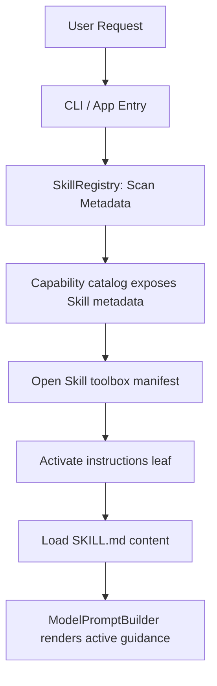

# testcode Skill System Design

## Document Scope

This document focuses on the Skill system only:

- skill directory structure and metadata
- discovery and matching
- runtime loading and prompt injection
- future references, assets, and scripts lifecycle

It does not redefine the whole runtime architecture or generic extension model:

- overall runtime layering: `docs/architecture.md`
- generic extension hooks: `docs/runtime-extensibility.md`
- capability warehouse, toolbox manifests, progressive disclosure, and activation: `docs/capability-warehouse.md`
- roadmap priority and rollout stages: `docs/build-roadmap.md`

Skill 在能力可见性上属于工具箱：默认只暴露 metadata 和简短描述，打开后展示 instructions/references/assets/scripts 索引，激活时才加载当前步骤需要的内容。该目标模型以 `docs/capability-warehouse.md` 为准；本文档继续负责 Skill 文件结构和箱内资产语义。

This document defines the Skill file format, discovery sources, toolbox contents, activation semantics, and current runtime boundary. Global priority and completion tracking remain in [docs/build-roadmap.md](build-roadmap.md).

---

## 1. Goal

Provide standard built-in and custom project/user Skills without loading every instruction body into every model request. The current application exposes Skill metadata through the capability warehouse; instructions enter model context only after explicit capability activation.

Skill loading follows the same long-task context rule as the rest of the runtime: full skill files and referenced artifacts may exist on disk, but the prompt receives only active, task-relevant, budgeted guidance after context packaging. A skill is not a mechanism for bypassing context budgets.

---

## 2. Skill Directory & Metadata Structure

Each skill is represented by a directory containing:
1. `SKILL.md`: The markdown instructions that define the behavior, prompts, and context for the skill.
2. Metadata: Defined via **YAML frontmatter** inside `SKILL.md` (YAML blocks between `---`). This keeps dependencies minimal and can be parsed with simple regular expressions.

### YAML Frontmatter Example (`SKILL.md`)
```markdown
---
name: python-unittest-helper
description: Provides guidelines and commands for writing and running Python unit tests.
triggers:
  - "run tests"
  - "python test"
  - "unittest"
version: 1.0.0
---

# Python Unittest Helper Skill

When writing or running Python unit tests:
- Prefer using `pytest` over standard `unittest` unless specified.
- Run tests using the `run_tests` tool.
- If a test fails, read the failing test file, inspect the imports, and check if mock objects are necessary.
```

---

## 3. Directory Layouts & Path Resolution

Skills are discovered from three locations:

1. **Built-in Skills**: Shipped with the `testcode` package. To ensure correct path resolution when installed as a package, paths must be resolved dynamically using `importlib.resources` or relative to the package directory (`Path(__file__).parent.parent / 'skills/builtins'`), rather than hardcoding static paths.
2. **Project-scoped Skills**: Stored inside the workspace at `.testcode/skills/`.
3. **User Global Skills**: Stored in the user's home directory at `~/.testcode/skills/`.

---

## 4. Architecture & Selection Flow

Application composition scans lightweight metadata into `SkillRegistry`, then exposes each Skill through `SkillToolboxSource`. The model can inspect the capability catalog, open one Skill toolbox to see its instructions manifest, and activate that leaf. Activated Skill content is attached to `SessionContext` and rendered by `ModelPromptBuilder`; a separate budgeted `ContextPackager` remains planned.



### Core Abstractions

We define the core models in `src/testcode/skills/model.py`:

```python
from dataclasses import dataclass

@dataclass(slots=True)
class SkillMetadata:
    name: str
    description: str
    triggers: list[str]
    version: str
    path: str  # Path to the SKILL.md file

@dataclass(slots=True)
class Skill:
    metadata: SkillMetadata
    content: str  # Markdown instructions under the frontmatter; packaging applies prompt budget.
```

The registry is implemented in `src/testcode/skills/registry.py`:

```python
class SkillRegistry:
    def __init__(self, builtins_dir: str, global_dir: str, project_dir: str) -> None:
        self.dirs = [builtins_dir, global_dir, project_dir]
        self._skills: dict[str, SkillMetadata] = {}

    def scan_metadata(self) -> None:
        """Lightweight scan of skill metadata. Does not load full file contents."""
        pass

    def match_skills(self, prompt: str) -> list[Skill]:
        """Matches a user prompt against triggers and returns populated Skill instances.
        
        Triggers must be matched case-insensitively and respect word boundaries (e.g. using
        regex pattern r"\b" + re.escape(trigger) + r"\b") to prevent substring false positives
        (e.g., prompt containing 'greatest' triggering the skill for 'test').
        """
        pass
```

---

## 5. Runtime Integration

The active application path is:

### 1. Application Assembly (`src/testcode/app.py`)
- Initialize the `SkillRegistry` with paths resolved dynamically.
- Wrap the registry in `SkillToolboxSource` and attach it to `CapabilityWarehouse`.
- Keep `SkillContextLoader` available as a compatibility extension, but do not register it in the current `create_app()` context-loader list.

### 2. Execution Engine (`src/testcode/orchestration/engine.py`)
- Restore persisted Skill capability ids and active Skill names at the start of a session run.
- Apply activated Skill objects from `CapabilityWarehouse` to `SessionContext`.
- Persist session-scoped active Skills into the execution summary for later turns.

### 3. Prompt Assembly
- `ModelPromptBuilder.build_messages(session)` currently reads `session.active_skills` directly and renders active guidance into the system lines:
    ```markdown
    ### Active Skill Guidelines:
    
    [Skill: python-unittest-helper]
    When writing or running Python unit tests:
    - Prefer using `pytest` over standard `unittest` unless specified...
    ```
- A future `ContextPackager` will own Skill-specific budgets, source references, clipping, and summaries. This behavior is a target, not part of the current request path.

### 4. Skill References and Artifacts
- `references/`, `assets/`, and `scripts/` must be indexed separately from prompt content.
- Reference files should be read on demand and clipped or summarized before prompt injection.
- Script execution must become an ordinary tool action and pass the same policy, approval, and logging path as built-in tools.
- Skill content included in a long-task resume packet should be the active skill name, version, matched trigger, short guidance summary, and source path, not the full skill body by default.

---

## 6. Logging & Observability Contract

Skill activation must remain observable through the following records:

1. **Event `skills.matched`**:
   - The compatibility trigger-matching path emits this event during run initialization.
   - Payload:
     ```json
     {
       "matched_skills": [
         {
           "name": "python-unittest-helper",
           "version": "1.0.0",
           "matched_trigger": "run tests"
         }
       ]
     }
     ```
2. **Run start payload**:
   - `run.start` lists scanned/registered skills for discovery diagnostics:
     ```json
     {
       "registered_skills": ["python-unittest-helper", "git-helper"]
     }
     ```
3. **Trace file (`details.log`)**:
   - The overview lists active skills:
     ```text
     Overview
     - run_id: 2026-06-23T14-53-32
     - prompt: run tests in this workspace
     - active skills: python-unittest-helper (v1.0.0)
     ```

---

## 7. Current Boundary

The current runtime scans Skill metadata, exposes Skills through `SkillToolboxSource`, activates instructions through the capability warehouse, injects active instructions into model context, and restores session-scoped activations. Built-in `git-helper` and `pytest-helper` Skills exercise this path.

`SkillContextLoader` trigger matching remains a compatibility path rather than the primary `create_app()` assembly. Standardized on-demand handling for `references/`, `assets/`, and `scripts`, plus budgeted source references and script approval semantics, is not yet complete.

Implementation priority and completion status belong to [the build roadmap](build-roadmap.md); this document owns the Skill format and runtime contract.
