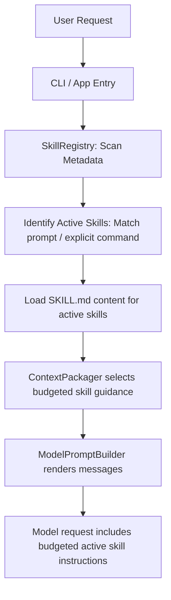

# testcode Skill System Specification & Implementation Plan

## Document Scope

This document focuses on the Skill system only:

- skill directory structure and metadata
- discovery and matching
- runtime loading and prompt injection
- future references, assets, and scripts lifecycle

It does not redefine the whole runtime architecture or generic extension model:

- overall runtime layering: `docs/architecture.md`
- generic extension hooks: `docs/runtime-extensibility.md`
- roadmap priority and rollout stages: `docs/build-roadmap.md`

This document outlines the architecture, data structures, and implementation plan for the **Skill System (P2)** in the `testcode` project, aligned with the goals specified in [docs/build-roadmap.md](build-roadmap.md).

---

## 1. Goal

Introduce a Skill System to `testcode` that allows standard (built-in) and custom (project-scoped or user-global) skills to be discovered, loaded dynamically based on user prompts or commands, and injected into the model context to provide specialized workflows, instructions, or tools.

Skill loading follows the same long-task context rule as the rest of the runtime: full skill files and referenced artifacts may exist on disk, but the prompt receives only active, task-relevant, budgeted guidance after context packaging. A skill is not a mechanism for bypassing context budgets.

---

## 2. Skill Directory & Metadata Structure

Each skill is represented by a directory containing:
1. `SKILL.md`: The markdown instructions that define the behavior, prompts, and context for the skill.
2. Metadata: Defined via **YAML frontmatter** inside `SKILL.md` (YAML blocks between `---`). This keeps dependencies minimal and can be parsed with simple regular expressions.

### YAML Frontmatter Example (`SKILL.md`)
```markdown
---
name: python-unittest-helper
description: Provides guidelines and commands for writing and running Python unit tests.
triggers:
  - "run tests"
  - "python test"
  - "unittest"
version: 1.0.0
---

# Python Unittest Helper Skill

When writing or running Python unit tests:
- Prefer using `pytest` over standard `unittest` unless specified.
- Run tests using the `run_tests` tool.
- If a test fails, read the failing test file, inspect the imports, and check if mock objects are necessary.
```

---

## 3. Directory Layouts & Path Resolution

Skills are discovered from three locations:

1. **Built-in Skills**: Shipped with the `testcode` package. To ensure correct path resolution when installed as a package, paths must be resolved dynamically using `importlib.resources` or relative to the package directory (`Path(__file__).parent.parent / 'skills/builtins'`), rather than hardcoding static paths.
2. **Project-scoped Skills**: Stored inside the workspace at `.testcode/skills/`.
3. **User Global Skills**: Stored in the user's home directory at `~/.testcode/skills/`.

---

## 4. Architecture & Selection Flow

The execution engine reads metadata during initialization and matches triggers dynamically. Active skill content then becomes candidate context; `ContextPackager` decides what budgeted skill guidance reaches the system prompt.



### Core Abstractions

We define the core models in `src/testcode/skills/model.py`:

```python
from dataclasses import dataclass

@dataclass(slots=True)
class SkillMetadata:
    name: str
    description: str
    triggers: list[str]
    version: str
    path: str  # Path to the SKILL.md file

@dataclass(slots=True)
class Skill:
    metadata: SkillMetadata
    content: str  # Markdown instructions under the frontmatter; packaging applies prompt budget.
```

The registry is implemented in `src/testcode/skills/registry.py`:

```python
class SkillRegistry:
    def __init__(self, builtins_dir: str, global_dir: str, project_dir: str) -> None:
        self.dirs = [builtins_dir, global_dir, project_dir]
        self._skills: dict[str, SkillMetadata] = {}

    def scan_metadata(self) -> None:
        """Lightweight scan of skill metadata. Does not load full file contents."""
        pass

    def match_skills(self, prompt: str) -> list[Skill]:
        """Matches a user prompt against triggers and returns populated Skill instances.
        
        Triggers must be matched case-insensitively and respect word boundaries (e.g. using
        regex pattern r"\b" + re.escape(trigger) + r"\b") to prevent substring false positives
        (e.g., prompt containing 'greatest' triggering the skill for 'test').
        """
        pass
```

---

## 5. Runtime Modifications

To support dynamic skill injection, the following runtime components are modified:

### 1. Application Assembly (`src/testcode/app.py`)
- Initialize the `SkillRegistry` with paths resolved dynamically.
- Pass `SkillRegistry` to `ExecutionEngine` or `SkillContextLoader` (if utilizing the extensible [ContextLoader](runtime-extensibility.md) hook).

### 2. Execution Engine (`src/testcode/orchestration/engine.py`)
- During `execute(request: UserRequest)`:
  - Query `SkillRegistry.match_skills(request.prompt)` to locate matches.
  - Merge matched skills with the existing `session.active_skills` to persist them throughout the multi-turn session. This prevents skills from being unloaded when later prompts do not contain trigger keywords.
  - Store matched `Skill` objects in the `SessionContext` (e.g., as `session.active_skills`).

### 3. Context Packaging and Prompt Assembly
- Before `ModelPromptBuilder.build_messages(session)`:
  - `ContextPackager` reads `session.active_skills`.
  - It converts active skill content into budgeted guidance with source references.
- In `ModelPromptBuilder.build_messages(...)`:
  - Render the packaged skill guidance into the system lines:
    ```markdown
    ### Active Skill Guidelines:
    
    [Skill: python-unittest-helper]
    When writing or running Python unit tests:
    - Prefer using `pytest` over standard `unittest` unless specified...
    ```
  - If active skill content exceeds the prompt budget, `ContextPackager` keeps high-level workflow rules and source references, then omits or summarizes examples and long reference material.

### 4. Skill References and Artifacts
- `references/`, `assets/`, and `scripts/` must be indexed separately from prompt content.
- Reference files should be read on demand and clipped or summarized before prompt injection.
- Script execution must become an ordinary tool action and pass the same policy, approval, and logging path as built-in tools.
- Skill content included in a long-task resume packet should be the active skill name, version, matched trigger, short guidance summary, and source path, not the full skill body by default.

---

## 6. Logging & Observability Layer Adjustments

To ensure that skill execution is transparent, the following additions are made to `InMemoryLogger`:

1. **New Event `skills.matched`**:
   - Emitted during the initialization of the execution run.
   - Payload:
     ```json
     {
       "matched_skills": [
         {
           "name": "python-unittest-helper",
           "version": "1.0.0",
           "matched_trigger": "run tests"
         }
       ]
     }
     ```
2. **Log Run Start Payload Modification**:
   - Modify `run.start` payload to list all scanned/registered skills to debug trigger matching issues:
     ```json
     {
       "registered_skills": ["python-unittest-helper", "git-helper"]
     }
     ```
3. **Trace file (`details.log`) updates**:
   - Update `_write_details_log` to list active skills in the overview section:
     ```text
     Overview
     - run_id: 2026-06-23T14-53-32
     - prompt: run tests in this workspace
     - active skills: python-unittest-helper (v1.0.0)
     ```

---

## 7. Implementation Status

### Step 1: Create `src/testcode/skills/` module
- [x] Create `src/testcode/skills/__init__.py`
- [x] Create `src/testcode/skills/model.py` for representation.
- [x] Create `src/testcode/skills/registry.py` for discovery, loading, and matching.

### Step 2: Implement Metadata Parser
- [x] A simple frontmatter parser extracts YAML blocks from `SKILL.md` using dependency-light parsing.

### Step 3: Integrate with App & CLI Loop
- [x] Update `src/testcode/app.py` to initialize `SkillRegistry` and register `SkillContextLoader`.
- [x] Scan for skills at engine startup and before runs.
- [x] Before invoking the model, match the user request against the registry, merge with session-active skills, and store them.
- [x] Update `src/testcode/model/prompt.py` to format and inject active skill instructions into the system prompt.

### Step 4: Write Built-in Skills & Tests
- [x] Create default built-in skills such as `git-helper` and `pytest-helper`.
- [x] Add unit tests verifying:
  - Skill metadata parsing.
  - Skill auto-triggering on matching keyword/trigger.
  - Explicit skill loading.
  - Verified injection into system prompt.
  - Persistence of matched skills across multiple conversation turns.
- [ ] Add tests for budgeted injection and source references when skill content is too large.
- [ ] Add tests for references/assets/scripts once those lifecycle rules are implemented.
