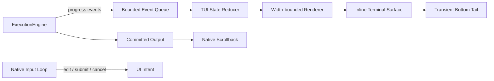

# testcode CLI TUI 设计与实现

## 文档范围

本文档描述当前交互式 TTY 的实际行为。`--once`、重定向、CI 和非 TTY 环境继续使用 `ConsolePresenter` 的逐行输出；交互式会话使用 `TUIConsolePresenter` 的原生终端 backend。

当前实现不依赖 `prompt_toolkit`，也不进入 alternate screen。目标是同时保留终端原生 scrollback、鼠标滚轮、文本选择与复制，并只让程序拥有底部的瞬态活动区域。

## 1. 屏幕所有权

终端内容分为两类：

```text
终端原生 scrollback
├── 启动 Logo 和环境信息
├── 已提交的用户消息
├── 已完成的工具结果
├── 助手回答
└── Worked for … 分隔线

程序控制的瞬态尾部
├── 工具/审批/Thinking 状态
├── 可编辑输入框
└── 模型名称与工作目录
```

稳定内容只写入 stdout 一次，之后由终端保存、重排、滚动、选择和复制。程序不保存第二份可见 transcript，也不捕获鼠标。

瞬态尾部紧跟稳定内容，不强制占用终端物理底边。每次刷新只清理上一次尾部覆盖的区域，再绘制新帧；窗口缩放时会按新宽度计算旧帧可能产生的视觉行数和光标位置，避免留下重复的 Working、输入框、模型状态或空白占位。

## 2. 当前布局

### 启动区

```text
  _            _                 _
 | |_ ___  ___| |_ ___  ___   __| | ___
 ...
────────────────────────────────────────────────────────
 › Workspace:   /workspace
 › Session:     Started - ...
 › Safety Mode: confirm (Tool calls require approval)
 › System:      Python ... on Linux
────────────────────────────────────────────────────────
 › Runtime:
   • 3 Context Loaders
   • 17 Tools
 › Capability Catalog:
   • 2 Skills
   • 1 MCP Server
────────────────────────────────────────────────────────
  Type "exit" or "quit" to end the session.
```

这些内容立即进入原生历史，不会在 resize 时由应用重新打印。

### 空闲输入

```text

 testcode> editable input

 ? for shortcuts                                      model
```

输入区有上下留白和灰色背景。内容按 Unicode 显示宽度折行，最多显示三行；模型状态位于输入框下方。

### 运行中

```text

 • read_file → README.md
 ⠋ Model is thinking (8s • esc to interrupt)


 testcode> steer the next turn

  qwen3.6-plus · /workspace
```

Thinking/Working 活动块上下各保留一行终端底色空白。输入提示符和其后的可编辑文本会分别着色，但共享同一层灰色背景；行尾通过当前背景色的 erase-to-end 完成填充，不输出会在 resize 时参与 reflow 的空格。

模型或工具工作时输入器仍然存活。提交非空内容会请求中断当前 run，并把内容排队为下一轮消息；没有提交的草稿会回到下一次空闲输入框。

每轮结束后写入：

```text
─ Worked for 3m 40s ───────────────────────────────────

```

## 3. 事件与状态边界

`ExecutionEngine` 不直接操作终端。模型、工具、审批、重试、取消和 resize 都先进入有界事件队列，再由 reducer 生成 `TUIState`。



职责边界：

- `TUIController`：有序消费事件并维护不可变视图状态。
- `TUIRenderer`：生成 Working、工具、审批和运行环境行。
- `ComposerState`：维护文本、光标和会话内输入历史。
- `InlineTerminalSurface`：唯一负责瞬态尾部的清理、底部锚定和光标定位。
- `TUIConsolePresenter`：把 engine 回调转换为事件，协调输入、渲染和稳定内容提交。
- `ConsolePresenter`：非 TTY 和兼容路径。

## 4. 输入语义

原生编辑器使用 cbreak 模式，但不启用任何鼠标协议。它支持：

- UTF-8、中文、宽字符和组合字符；
- 左右移动、Home、End、Backspace、Ctrl-D 删除；
- 上下键浏览会话内输入历史；
- bracketed paste，粘贴内容不会被拆成控制命令；
- Alt+Enter 插入换行，Enter 提交；
- 空输入时 Ctrl-D 结束会话；
- 运行时 Esc/Ctrl-C 请求中断；
- 审批时方向键选择，Enter 确认，`y`/`n` 直接决定。

终端设置由输入上下文保存并在正常结束、异常、中断时恢复。运行期间只有一个输入线程读取 stdin，不会再出现 Spinner、审批器和输入框争抢输入的问题。

## 5. 滚动、选择与复制

应用从不发送鼠标捕获序列，因此：

- 鼠标滚轮由终端处理原生 scrollback；
- 鼠标保持终端文本选择语义；
- 不需要 F2 模式，也不需要按住 Shift 才能选择；
- 滚轮不会被输入器解释为上下键历史。

这是当前 backend 与旧 fullscreen 方案的核心区别。稳定历史属于终端，程序只更新底部瞬态帧。

## 6. Resize 规则

- 稳定历史不重画，交给终端原生 reflow。
- 瞬态行始终限制在当前宽度以内，并预留一列避免 pending autowrap。
- 尾部记录旧帧内容、逻辑光标行和光标列；缩窄时计算光标之前的旧行在新宽度下产生的视觉高度。
- 清理从 reflow 后的实际光标位置回到帧首，不通过换行或空格预留物理底部区域。
- 空闲输入循环轮询终端尺寸；运行渲染循环以 10 FPS 同时处理 spinner 和 resize。

稳定的全宽边框在终端缩窄时可能被终端显示为续行，这是原生 scrollback 的正常 reflow，不是应用重复输出。

## 7. 回退与验证

只有 stdin/stdout 同时为 TTY 时才选择原生 TUI。plain 路径不输出光标移动、隐藏光标或 bracketed-paste 控制序列。

回归至少覆盖：

- 事件队列背压和 reducer 状态；
- UTF-8、多行、光标和历史编辑；
- 窄屏 Unicode 宽度；
- 瞬态尾部局部清理且不进入 alternate screen；
- resize 后无重复活动行；
- 运行中输入、中断排队、审批和草稿恢复；
- 模型状态位于输入框下方；
- 稳定工具结果只提交一次；
- `Worked for …` 后保留空行；
- 完整 CLI 的真实终端 shrink/grow 验证。
