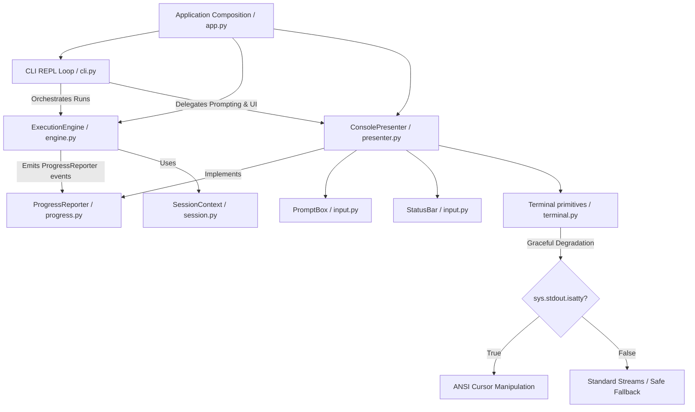

# testcode CLI: TUI Design & Architecture Specification

This document provides a unified overview of the design decisions, TUI layout specifications, and architectural patterns implemented in the `testcode` workbench CLI. It details how the terminal user interface mimics the styling of **Antigravity CLI** (`agy`) while maintaining professional software development standards.

---

## Document Scope

This document owns terminal interaction behavior: prompt editing, visual width, borders, status lines, selection input, resize redraw, and terminal compatibility limits. It does not define execution-engine flow, tool contracts, capability activation, or product priority; those belong to `docs/architecture.md`, `docs/tool-contract.md`, `docs/capability-warehouse.md`, and `docs/build-roadmap.md`.

---

## 1. Design & TUI Layout

### Design Principles
- **Futuristic & Clean**: Uses a Cyan ASCII art logo and clean thin borders (`─`) to establish visual hierarchy.
- **Environment & Mode Awareness**: Clear visibility into safety modes (`confirm`, `auto`, `readonly`) with distinct colors (yellow, magenta, green).
- **Consolidated Progress**: Displays live progress (Model thinking spinner, tool executions, and user approvals) using elegant status symbols.
- **Clean Input Sandboxing**: Inputs and confirmation dialogs are sandwiched between horizontal lines, with bottom status bars (`? for shortcuts`, `esc to cancel`) dynamically erased upon submission.
- **TTY-aware Editing**: Interactive terminals use a cbreak-mode editor with UTF-8 input, cursor movement, deletion, visual wrapping, and resize handling. Redirected input keeps a plain-stream fallback.
- **Status Bullets**: Tool logs use bullet points (`•`) with status color-coding (Green for success, Red for failure, Yellow for executing/skipped/requesting permission) instead of busy checkmarks.

### Visual Previews

#### A. Startup Banner
```
  _            _                 _                 
 | |_ ___  ___| |_ ___  ___   __| | ___ 
 | __/ _ \/ __| __/ __|/ _ \ / _` |/ _ \
 | ||  __/\__ \ || (__| (_) | (_| |  __/
  \__\___||___/\__\___|\___/ \__,_|\___|

─────────────────────────────────────────────────────────────────
 › Workspace:   /home/changsai/testcode
 › Session:     Started - 9289f744-35a7-41a4-a462-12a0de37dc6b
 › Safety Mode: confirm (Tool calls require approval)
 › System:      Python 3.14.4 (.venv) on Linux
─────────────────────────────────────────────────────────────────
 › Loaded Components:
   • 3 Context Loaders
   • 17 Tools
   • 2 Skills
─────────────────────────────────────────────────────────────────
  Type "exit" or "quit" to end the session.
```

#### B. Active Sandboxed Input TUI (Typing state)
```
─────────────────────────────────────────────────────────────────
 testcode> _
─────────────────────────────────────────────────────────────────
 ? for shortcuts                                     qwen3.6-plus
```

#### C. Live Progress & Tool Calls
```
 • Model is thinking... ⠋
 • read_file -> Executing ⠋
 • read_file(path=src/app.py) -> 178 lines
 • Model is thinking... ⠋
```

---

## 2. Software Architecture

The TUI follows a small Presenter-oriented architecture. The REPL loop, execution engine, progress reporting, and terminal rendering are kept separate so the core model/tool loop can run without depending on a concrete terminal UI.



### Key Software Principles Checked

- **Modularity & Separation of Concerns**: `ConsolePresenter` is the public presentation facade, while prompt frame handling, status bar state, terminal width, borders, and spinners are split into smaller interaction modules. The main loop in `CLI` has no knowledge of colors or cursor movement.
- **Single Responsibility Principle (SRP)**:
  - `CLI`: Manages sessions, command history, and loops the REPL shell.
  - `ExecutionEngine`: Controls the model client, policy checks, duplicate suppression, and tool execution.
  - `ProgressReporter`: Defines execution progress events without terminal concepts.
  - `ConsolePresenter`: Renders session state, summaries, approvals, and progress events.
  - `PromptBox`: Owns TTY input editing, prompt frames, resize handling, and confirmation selection input.
  - `StatusBar`: Owns status line rendering and cleanup state.
  - `terminal.py`: Owns low-level terminal primitives such as ANSI constants, width detection, borders, and spinner behavior.
- **Open/Closed Principle & Extensibility (OCP)**: A non-terminal UI can implement `ProgressReporter` without modifying `ExecutionEngine`. The current terminal UI adapts dynamically to terminal size via `os.get_terminal_size()`.
- **Robustness & Graceful Degradation**: Direct cursor movements can corrupt output streams in non-interactive environments (CI/CD, subprocesses, tests). Terminal components check `sys.stdout.isatty()` before executing cursor movement, falling back to clean line-by-line output.
- **Failure Transparency**: Tool execution exceptions are not masked by progress rendering. If a tool raises before returning a `ToolResult`, the progress handle is stopped through `tool_aborted()` and the original exception continues upward.

---

## 3. Core Implementation Details

### A. TTY Input Editor and Plain-Stream Fallback

On an interactive TTY, `PromptBox` switches stdin to cbreak mode and owns the editable value and cursor index. The editor supports:

- UTF-8 characters read across multiple terminal bytes, including Chinese input;
- Backspace, Ctrl-D deletion, left/right arrows, Home, and End;
- Ctrl-C as `KeyboardInterrupt` and Ctrl-D on an empty value as `EOFError`;
- complete escape-sequence consumption so mouse and unsupported control sequences do not leak into prompt text.

When stdin or stdout is not a TTY, the code falls back to standard `input()`. ANSI prompt fragments in that fallback retain Readline ignore markers so visible prompt width remains correct where Readline is available.

### B. Visual Width, Wrapping, and Frame Redraw

Input wrapping is calculated before rendering instead of being delegated entirely to terminal autowrap:

- East Asian full-width and wide characters count as two columns;
- combining marks do not add a display column;
- one terminal column is deliberately left unused to avoid pending-autowrap ambiguity;
- the input frame expands by visual rows while keeping the cursor at the corresponding wrapped position.

The live frame is rendered directly after the transcript. On each edit, the previous frame is cleared and redrawn with the current input, borders, and status line. Submitted input is then written back as a stable transcript block with both borders.

### C. Resize Handling

`PromptBox` installs a temporary `SIGWINCH` handler while reading input. Resize bursts are settled briefly before redraw, then the frame recomputes wrapping from the new terminal width. The renderer records the previous width and cursor row so it can account for old rows that reflowed after a shrink.

This is a best-effort normal-screen implementation. See **Known Limitations** below for the remaining terminal-history constraint.

### D. Confirmation Selection

TTY confirmations accept arrow keys or `j`/`k`, direct numeric choices, `y`/`n`, Enter, Escape, and Ctrl-C. A renderer hook allows the selection frame to be replaced without coupling the execution engine to a specific terminal UI.

### E. Vertical Space and Status-Line Recovery

The bottom status line can be rendered without a trailing newline while an input frame is active. This is important when it occupies the last terminal row: emitting a newline there would scroll the whole screen once per keypress. Running-status cleanup separately reclaims its printed row without leaving growing vertical gaps.

### F. Progress Reporting Boundary
`ExecutionEngine` does not call terminal-specific methods directly. It emits lifecycle events through `ProgressReporter`:

- `model_started` / `model_finished`
- `tool_started` / `tool_finished`
- `tool_aborted`
- `tool_skipped`

`ConsolePresenter` implements this protocol by delegating to spinner and tool-line rendering methods. This keeps the orchestration layer usable in headless tests, alternate UIs, or future logging-only execution modes.

### G. ANSI-Safe Full-Width Lines

Borders are generated from visible width first and then wrapped in ANSI color codes. On a TTY, autowrap is temporarily disabled while a full-width border or status line is written, preventing the final column from leaving a pending wrap. Narrow status bars truncate their left and right labels instead of overflowing onto another row.

### H. Input and Exception Semantics
Ctrl-C and Ctrl-D retain distinct meanings in the prompt layer. Ctrl-C raises `KeyboardInterrupt`; Ctrl-D raises `EOFError` so the CLI can close the session through its EOF branch. Engine runtime state is also cleared on exceptional model/tool exits, preventing stale `current_session` data from leaking into later UI decisions.

---

## 4. Known Limitations and Design Boundary

The current UI intentionally stays on the terminal's normal screen so native scrollback remains available. This creates one unresolved compatibility boundary:

- a live full-width top border sits above the input cursor;
- some terminals, especially during repeated shrink-and-grow operations, preserve intermediate reflowed border rows as history;
- ANSI cursor movement can clear the visible frame but cannot reliably identify or rewrite rows that a terminal has already committed to scrollback.

Resize debouncing and old-width row accounting reduce the occurrence but cannot guarantee removal across Windows Terminal, WSL, tmux, SSH clients, and other emulators.

Two future designs can provide a strict guarantee:

1. **Live single-bottom-border frame**: keep all mutable chrome at or below the cursor, then write both borders only after submission. This is the smallest robust change.
2. **Full-screen or alternate-screen TUI**: keep a program-owned screen/history model and repaint from that model. This preserves the full live frame but requires program-managed scrolling and substantially more terminal state handling.

The project should not keep adding terminal-specific cursor offsets to solve this limitation; a future fix should choose one of these structural designs.

---

## 5. Verification Contract

TUI changes should keep regression coverage for:

- TTY and plain-stream input paths;
- UTF-8 decoding, cursor editing, visual-width wrapping, and narrow terminals;
- resize row accounting and submitted-frame history;
- approval selection, Ctrl-C, Ctrl-D, and exceptional session cleanup;
- status-line fitting, progress completion/abort, and ANSI-safe full-width borders.

Run the project test suite with:

```bash
PYTHONPATH=src .venv/bin/python -m pytest -q
```
