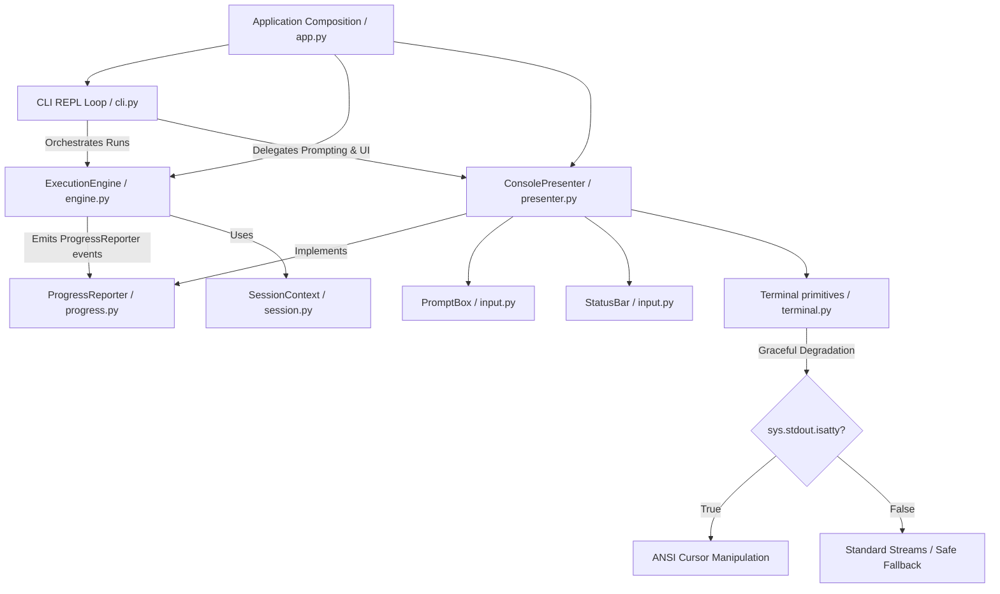

# testcode CLI: TUI Design & Architecture Specification

This document provides a unified overview of the design decisions, TUI layout specifications, and architectural patterns implemented in the `testcode` workbench CLI. It details how the terminal user interface mimics the styling of **Antigravity CLI** (`agy`) while maintaining professional software development standards.

---

## 1. Design & TUI Layout

### Design Principles
- **Futuristic & Clean**: Uses a Cyan ASCII art logo and clean thin borders (`─`) to establish visual hierarchy.
- **Environment & Mode Awareness**: Clear visibility into safety modes (`confirm`, `auto`, `readonly`) with distinct colors (yellow, magenta, green).
- **Consolidated Progress**: Displays live progress (Model thinking spinner, tool executions, and user approvals) using elegant status symbols.
- **Clean Input Sandboxing**: Inputs and confirmation dialogs are sandwiched between horizontal lines, with bottom status bars (`? for shortcuts`, `esc to cancel`) dynamically erased upon submission.
- **Status Bullets**: Tool logs use bullet points (`•`) with status color-coding (Green for success, Red for failure, Yellow for executing/skipped/requesting permission) instead of busy checkmarks.

### Visual Previews

#### A. Startup Banner
```
  _            _                 _                 
 | |_ ___  ___| |_ ___  ___   __| | ___ 
 | __/ _ \/ __| __/ __|/ _ \ / _` |/ _ \
 | ||  __/\__ \ || (__| (_) | (_| |  __/
  \__\___||___/\__\___|\___/ \__,_|\___|

─────────────────────────────────────────────────────────────────
 › Workspace:   /home/changsai/testcode
 › Session:     Started - 9289f744-35a7-41a4-a462-12a0de37dc6b
 › Safety Mode: confirm (Tool calls require approval)
 › System:      Python 3.14.4 (.venv) on Linux
─────────────────────────────────────────────────────────────────
 › Loaded Components:
   • 4 Context Loaders
   • 12 Tools
   • 2 Skills
─────────────────────────────────────────────────────────────────
  Type "exit" or "quit" to end the session.
```

#### B. Active Sandboxed Input TUI (Typing state)
```
─────────────────────────────────────────────────────────────────
 testcode> _
─────────────────────────────────────────────────────────────────
 ? for shortcuts                                     qwen3.6-plus
```

#### C. Live Progress & Tool Calls
```
 • Model is thinking... ⠋
 • read_file -> Executing ⠋
 • read_file(path=src/app.py) -> 178 lines
 • Model is thinking... ⠋
```

---

## 2. Software Architecture

The TUI follows a small Presenter-oriented architecture. The REPL loop, execution engine, progress reporting, and terminal rendering are kept separate so the core model/tool loop can run without depending on a concrete terminal UI.



### Key Software Principles Checked

- **Modularity & Separation of Concerns**: `ConsolePresenter` is the public presentation facade, while prompt frame handling, status bar state, terminal width, borders, and spinners are split into smaller interaction modules. The main loop in `CLI` has no knowledge of colors or cursor movement.
- **Single Responsibility Principle (SRP)**:
  - `CLI`: Manages sessions, command history, and loops the REPL shell.
  - `ExecutionEngine`: Controls the model client, policy checks, duplicate suppression, and tool execution.
  - `ProgressReporter`: Defines execution progress events without terminal concepts.
  - `ConsolePresenter`: Renders session state, summaries, approvals, and progress events.
  - `PromptBox`: Owns readline-safe input frames and confirmation selection input.
  - `StatusBar`: Owns status line rendering and cleanup state.
  - `terminal.py`: Owns low-level terminal primitives such as ANSI constants, width detection, borders, and spinner behavior.
- **Open/Closed Principle & Extensibility (OCP)**: A non-terminal UI can implement `ProgressReporter` without modifying `ExecutionEngine`. The current terminal UI adapts dynamically to terminal size via `os.get_terminal_size()`.
- **Robustness & Graceful Degradation**: Direct cursor movements can corrupt output streams in non-interactive environments (CI/CD, subprocesses, tests). Terminal components check `sys.stdout.isatty()` before executing cursor movement, falling back to clean line-by-line output.
- **Failure Transparency**: Tool execution exceptions are not masked by progress rendering. If a tool raises before returning a `ToolResult`, the progress handle is stopped through `tool_aborted()` and the original exception continues upward.

---

## 3. Core Implementation Details

### A. GNU Readline Multibyte & Backspace Fix
To prevent backspace lag (needing to press backspace twice) or character display freezing, the project:
1. Imports the standard `readline` module at CLI startup to handle terminal UTF-8 character length calculations.
2. Moves the cursor up (`\033[3A\r`) *externally* before calling `input()`, rather than embedding cursor movements inside the prompt string, keeping Readline's internal redraw loop in sync.
3. Wraps ANSI escape sequences in `\x01` and `\x02` readline ignore markers so that readline computes prompt column width correctly.

### B. Vertical Space Recovery
When clearing running status bars (`esc to interrupted`), the presenter shifts the cursor down by `lines_up - 1` lines rather than the full `lines_up` lines. This dynamically reclaims the printed status bar newline, avoiding large vertical spacing gaps.

### C. Progress Reporting Boundary
`ExecutionEngine` does not call terminal-specific methods directly. It emits lifecycle events through `ProgressReporter`:

- `model_started` / `model_finished`
- `tool_started` / `tool_finished`
- `tool_aborted`
- `tool_skipped`

`ConsolePresenter` implements this protocol by delegating to spinner and tool-line rendering methods. This keeps the orchestration layer usable in headless tests, alternate UIs, or future logging-only execution modes.

### D. ANSI-Safe Borders
Borders are generated from visible width first and then wrapped in ANSI color codes. This avoids truncating reset sequences on narrow terminals, which would otherwise leak color into later output.

### E. Input and Exception Semantics
Ctrl-C and Ctrl-D retain distinct meanings in the prompt layer. Ctrl-C raises `KeyboardInterrupt`; Ctrl-D raises `EOFError` so the CLI can close the session through its EOF branch. Engine runtime state is also cleared on exceptional model/tool exits, preventing stale `current_session` data from leaking into later UI decisions.

---

## 4. Code Modifications Inventory

- **CLI Interaction Layer**: `src/testcode/interaction/cli.py`
  - Added support for loading the `readline` module.
  - Delegated input prompting directly to `presenter.prompt_input`.
  - Integrated graceful keyboard interrupt handling.
- **Presenter Layer**: `src/testcode/interaction/presenter.py`
  - Keeps the public presentation facade for CLI output, session state, approvals, and summaries.
  - Implements the `ProgressReporter` protocol for model/tool lifecycle rendering.
  - Replaced checkboxes with status-colored bullet points.
  - Delegates prompt frames and status bar behavior to smaller interaction components.
- **Terminal Input Layer**: `src/testcode/interaction/input.py`
  - Adds `PromptBox` for readline-safe prompt and approval selection frames.
  - Adds `StatusBar` for status line display and cleanup.
  - Preserves distinct Ctrl-C and Ctrl-D control-flow semantics.
- **Terminal Primitive Layer**: `src/testcode/interaction/terminal.py`
  - Adds ANSI constants, terminal width detection, ANSI-safe colored borders, and spinner behavior.
- **Orchestration Layer**: `src/testcode/orchestration/engine.py`
  - Emits progress events through `ProgressReporter` instead of depending on `ConsolePresenter`.
  - Stops progress handles without masking original tool execution exceptions.
  - Finalizes progress handles using `is not None`, so falsy but valid handles are supported.
  - Maintains `current_session` while a run is active so the CLI can report interruption state.
  - Clears `current_session` on exceptional exits to avoid stale run state.
- **Progress Protocol**: `src/testcode/orchestration/progress.py`
  - Defines the optional progress sink used by the execution engine.
- **Model Parsing Layer**: `src/testcode/model/parser.py`
  - Fixed reply parsing to preserve paragraph newlines.
- **Testing Layer**: `tests/test_console_presenter_output.py`, `tests/test_execution_engine_sessions_and_cli_runtime.py`
  - Covers presenter rendering, status bars, spinners, readline-safe mocks, failed tool output formatting, ANSI-safe borders, progress-abort behavior, falsy progress handles, EOF preservation, and exceptional session cleanup.

---

## 5. Verification

Current verification command:

```bash
PYTHONPATH=src .venv/bin/python -m pytest -q
```

Latest local result:

```text
135 passed
```
